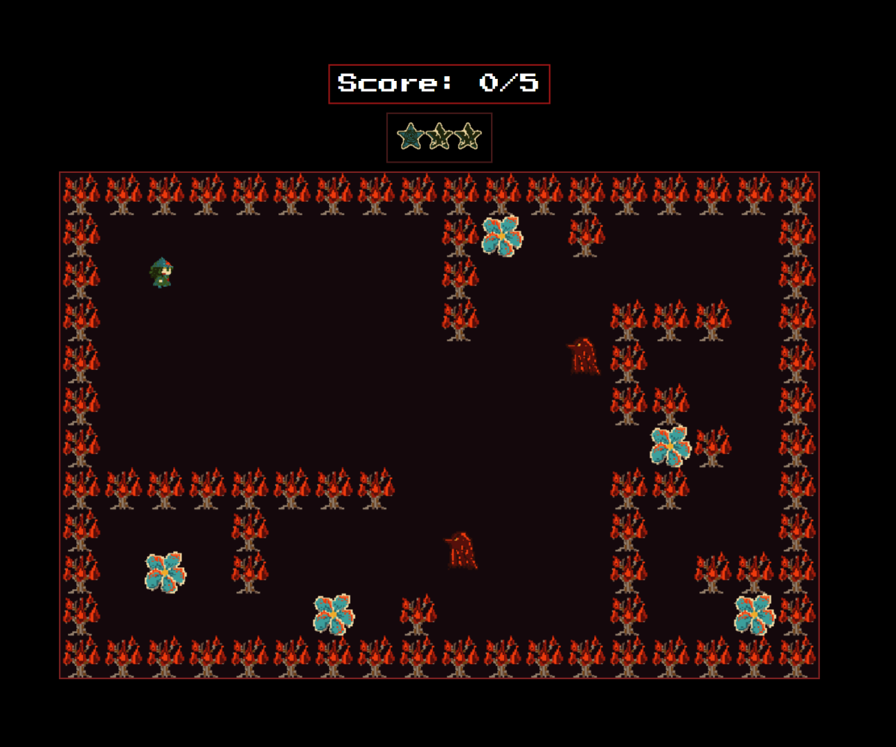
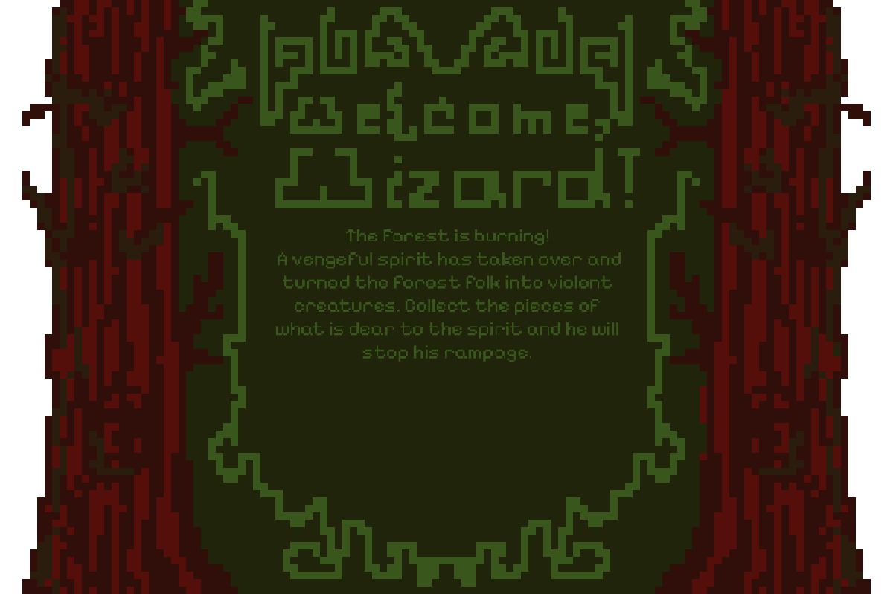
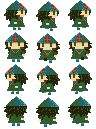
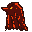
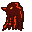
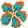

# 🪄 **A Real Story of a True Spirit Who Kind of Turned Very Angry** 

> The forest is burning! A vengeful spirit has taken over and turned the forest folk into violent creatures.
> You are a vvizard and have to collect the flowers that are dear to the spirit to turn him content and make him stop the fire.
> 

---

## 💖 **Play the Game**
[Click here to play the game!](https://your-github-username.github.io/repository-name)

---

## 🤳 **Screenshots**

### Main Gameplay:

  

---

### This is the Start Screen:

  

---

## 🧙🧙‍♂️ **Spritesheets**
Below are the sprites used to create characters and objects in the game:

### Player:

  

---

### Enemies and Items:

  
  

  

---

## 🪞 **Reflection**

### What went well:
- **Drawing the art:** Choosing a colour scheme was easy and drawing in pixel-art-style a new experience that went well.
- **Making the Music for the Game:** It was my first time making game music, I enjoyed it.

### Challenges:
- **Limited Time:** Due to sickness I had less time and struggled to start the game.
- **Implementing Anything:** I don't know much about js and due to that my game is not the best.

### Lessons Learned:
- **Ask for Help:** I struggled with this immensly, still do, but these weeks showed me that it is important to.
- **Aim for reasonable goals:** Look at your time and skills and make the best of it.
